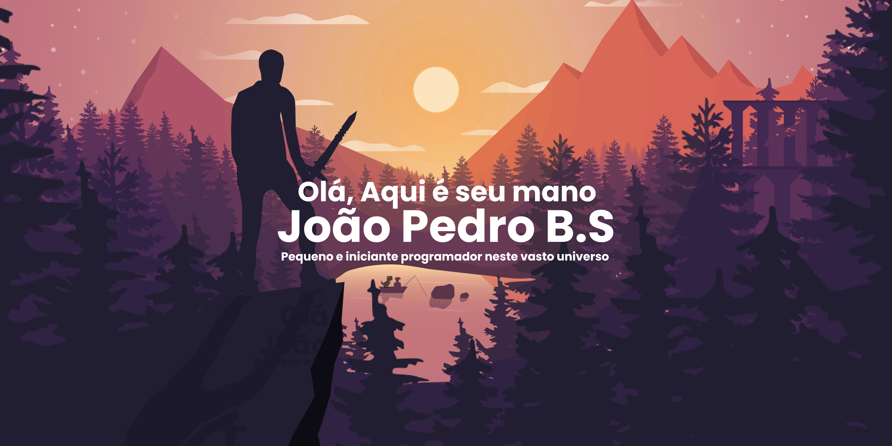

<h2 align ="center">🐧👍Github de Kakaribuu✍🐧</h2>

---

## Status do Github

    

## Tecnologias Dominadas

### Linguagens
   

### Frameworks e Bibliotecas
  

### Banco de Dados

### IDEs e Ambientes

### Ferramentas e Design
  

## Contatos

### Social Media

---

---

 
<b>👀 Visitor's Count 👀</b>
  

 
 

## Extras

### Soft skills 

- 👷‍♂️🛠️ Trabalho em Equipe 
- 🎨🖼️ Artista Tradicional
- 🖱️🎨 Artista Digital
- 🧑‍🦲📢 Comunicação
- 🙎👑 Liderança

### Frase motivacional

>"Aprender uma lição sem dor, não tem significado, isso porque as pessoas não conseguem aprender nada, sem sacrificar alguma coisa, mas quando elas superam as dificuldades e conseguem o que querem, elas conquistam um coração forte, que não perde para nada... Isso, um coração forte como aço!"
